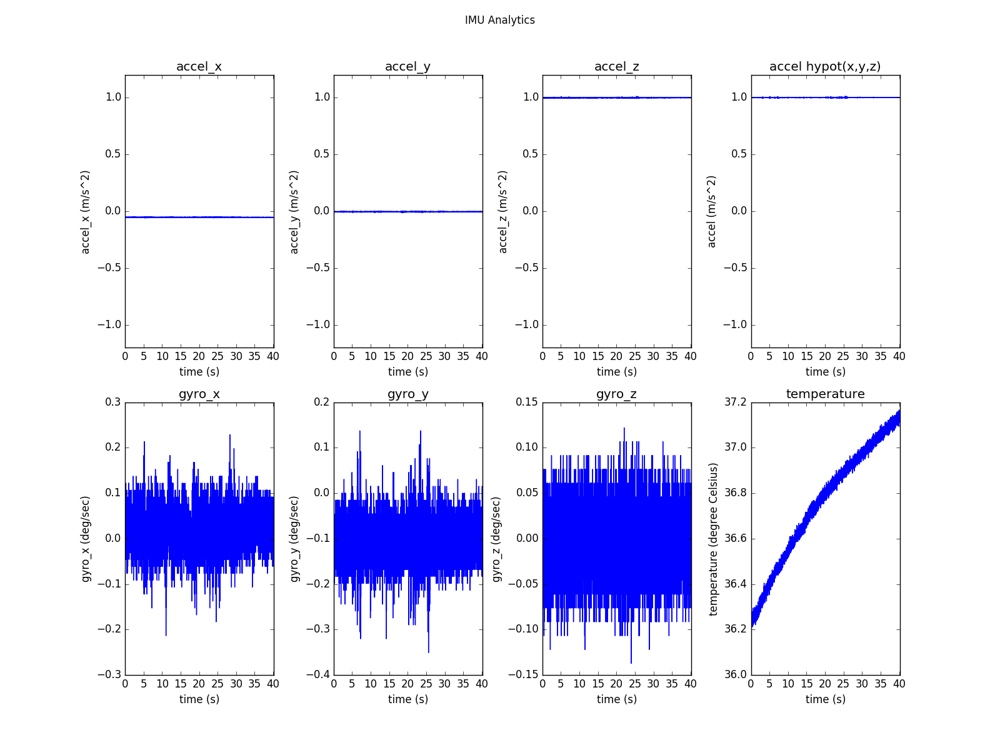

# Analyzing IMU
The SDK provides the script imu_analytics.py for IMU analysis. The tool details can be seen in tools/README.md .

Reference to run commands on Linux:

```
$ python tools/analytics/imu_analytics.py -i dataset -c tools/config/mynteye/mynteye_config.yaml -al=-1.2,1.2 -gl= -gdu=d -gsu=d -kl=
```

Reference to results on Linux:

```
$ python tools/analytics/imu_analytics.py -i dataset -c tools/config/mynteye/mynteye_config.yaml -al=-1.2,1.2 -gl= -gdu=d -gsu=d -kl=
imu analytics ...
  input: dataset
  outdir: dataset
  gyro_limits: None
  accel_limits: [(-1.2, 1.2), (-1.2, 1.2), (-1.2, 1.2), (-1.2, 1.2)]
  time_unit: None
  time_limits: None
  auto: False
  gyro_show_unit: d
  gyro_data_unit: d
  temp_limits: None
open dataset ...
  imu: 20040, temp: 20040
  timebeg: 4.384450, timeend: 44.615550, duration: 40.231100
save figure to:
  dataset/imu_analytics.png
imu analytics done
```

The analysis result graph will be saved in the data set directory. as follows:

                      

\latexonly
\includegraphics[width=0.3
\textwidth,keepaspectratio]{static/images/imu_analytics.png}
\endlatexonly

In addition, the script specific options can be executed -h:

```
$ python tools/analytics/imu_analytics.py -h
```


Copyright 2018. MYNTEYE
